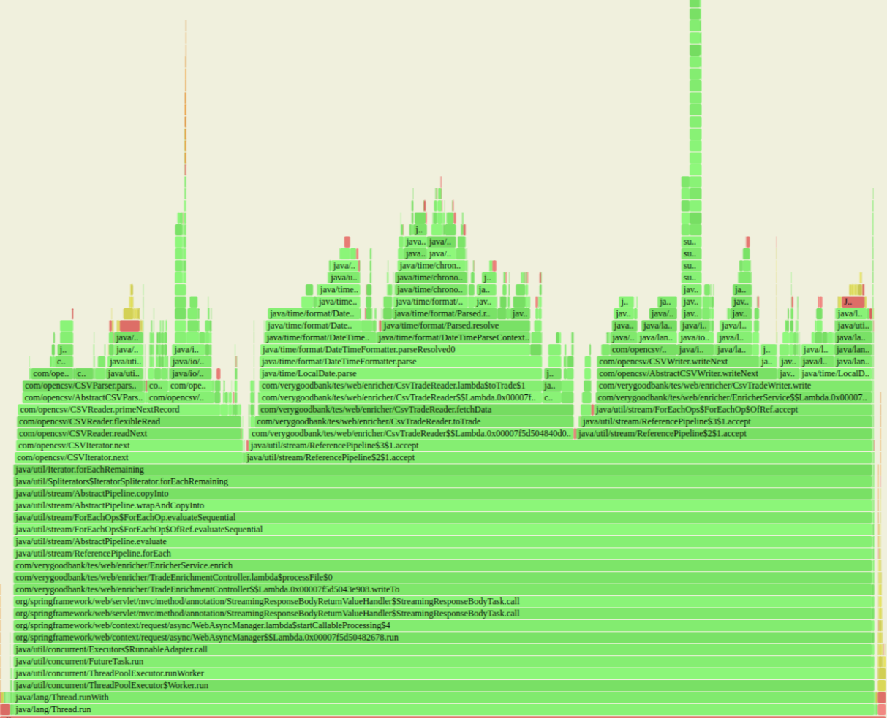
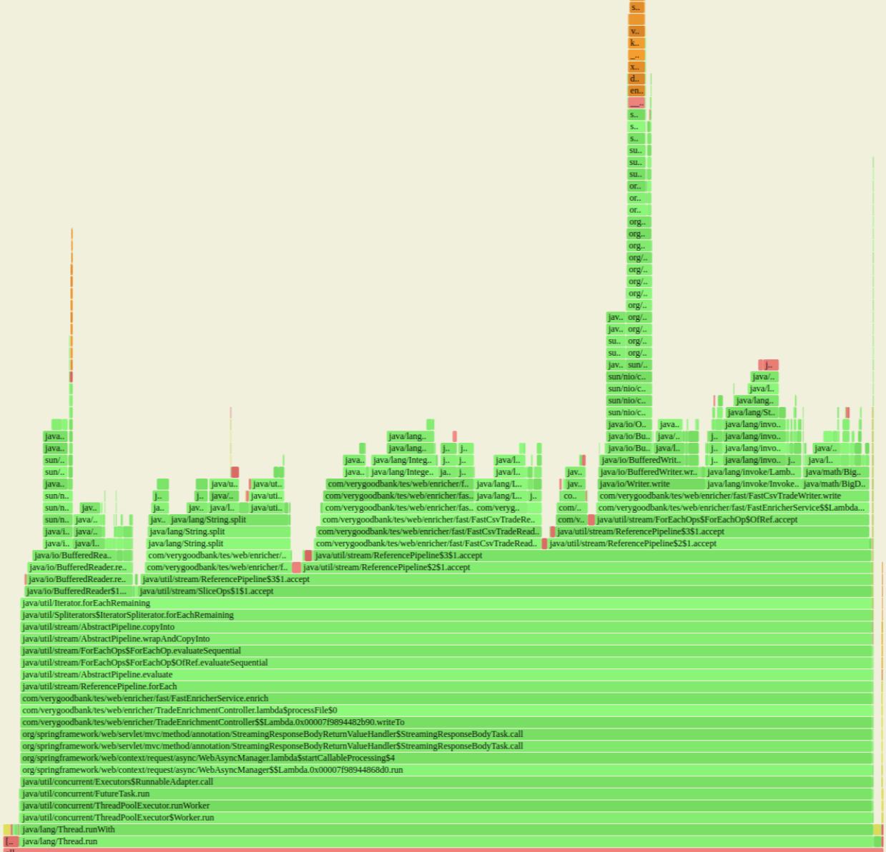
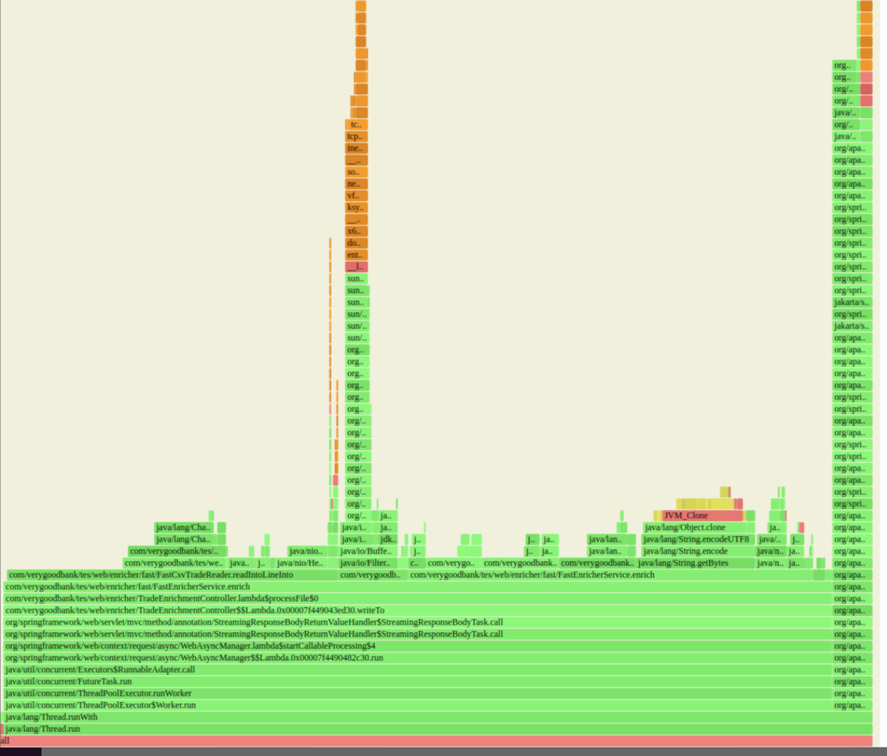
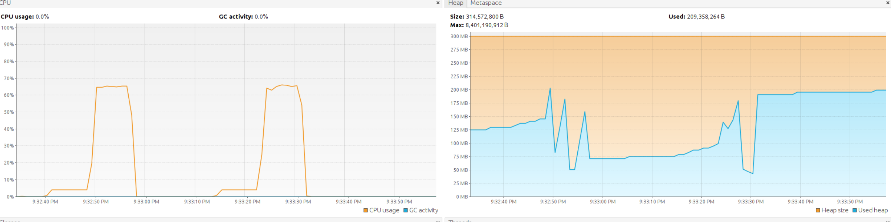
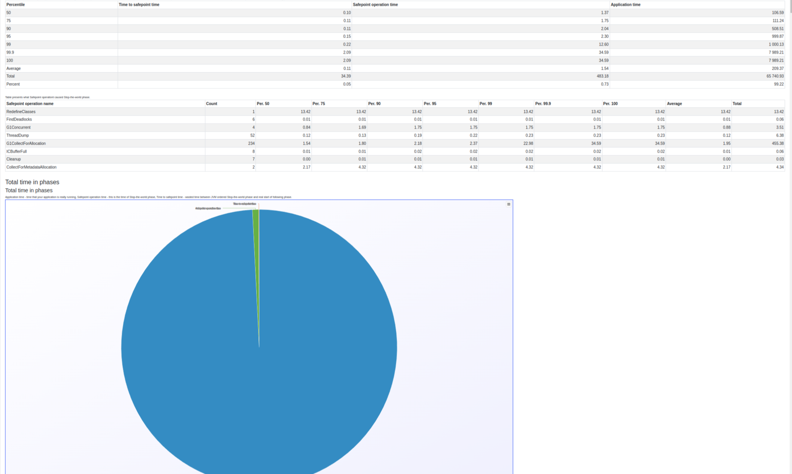
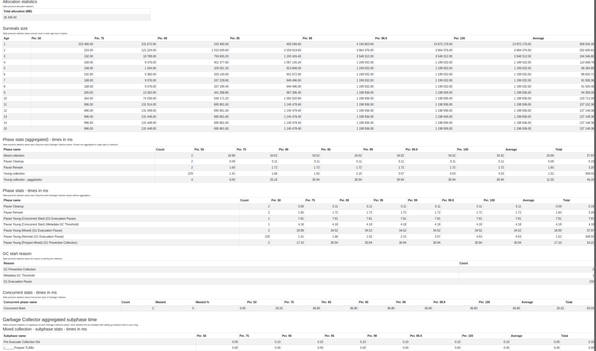

## HOW TO START

### Note
The repository contains a folder named `benchmark`, which includes the file `trade.csv` containing 100k trade rows (2 MB),
and the file `src/main/resources/product.csv` (placed on the classpath) with id -> product mappings (100k entries, 2 MB).
This makes it easier to perform benchmarks. I added the one-liner that allows you to enlarge the file N times by copying and overwriting itself, while keeping the header intact.

Of course, it is also possible to provide your own files according to the instructions below.

NOTE: The concurrent version only supports Linux line endings (\n) in files, so either use this format or run the serial version.

1. Clone the repository: `git clone`
2. Move to the project directory: `cd trade-enricher`
3. Build app:   
- Linux: `./mvnw clean install`  
- Windows: `.\mvnw.cmd clean install`
4. Run app: 
  `java -jar target/enricher.jar --server.port=8080 --spring.profiles.active=concurrent --product-file-path=src/main/resources/product.csv`

`server.port` = port on which to start the server (default: `8080`)  
`spring.profiles.active` = `serial` or `concurrent` (description below, default: `concurrent`)  
`product-file-path` = path to file with product id -> name mappings (default: `src/main/resources/product.csv`)

5. Make the file 100 times larger to contain 10 million records

```
FILE_PATH="benchmark/trade.csv"; N=100; { head -n 1 "$FILE_PATH"; tail -n +2 "$FILE_PATH"; for ((i=1; i<N; i++)); do tail -n +2 "$FILE_PATH"; done; } > "$FILE_PATH.tmp" && mv "$FILE_PATH.tmp" "$FILE_PATH"
```

6. Run benchmark - The output will be saved to the file `output.csv`    
`curl -X POST -F "file=@benchmark/trade.csv" http://localhost:8080/api/v1/enrich -o output.csv`

### Concurrent & Serial

Due to having a bit more time, I decided to play around with this use case and created two versions - one prioritizing readability, 
located in `com.verygoodbank.tes.web.enricher`, and the other focusing on performance, located in `com.verygoodbank.tes.web.enricher.concurrent`

Depending on the flag `spring.profiles.active` passed during startup, the application will be handled by a different service.
Below, I have included a brief description of how the concurrent version was accelerated.

Both versions stream the input - regardless of the number of requests and the size of the files, they should not consume more than 200-300MB during processing.

In both approaches, I decided to load the mappings file into memory. I would do this in production as well, even if the file were significantly larger. Alternatively,
I might store it off-heap to reduce pressure on the garbage collector. However, this is crucial for efficient matching. Without it, for completely random input, we wouldn't be 
able to intelligently cache and performance would be terribly poor.

In unit tests, instead of loading files from resources, I create CSVs in RAM using a library. 
This way, I don't have to create multiple files with different contents to test various use cases, and the tests execute much faster

All enricher classes are located in the same package, without separation into DAO, controller, service layers, etc. This is part of a hexagonal architecture, which solves many problems, including not having to think about the differences between "xManager," "xService," and "xProvider," and which class to use. Here, there is only one public class, so we don't have a choice and only use it.
In the "layered" approach, everything must be public because layers communicate with each other (service uses DAO, etc.), and if they are in different packages, they must be public in Java.
Additionally, it is much easier to test because by testing just one public service, we end up testing 100% of the business logic.
It is also easier to extract a microservice from it since everything is in one package

### Future improvements
Both versions lack sufficient logging. There is a need for more information on what is happening and how long each process takes

Unit tests would also be useful where we mock input/output streams and, for example, throw an exception on read or write to simulate different scenarios

#### Serial
In the serial version (the readable one) one improvement would be to use a better library (more efficient, e.g., FastCSV or Chronicle-Wire lib). Additionally, the current code  
`csvWriter.writeNext(new String[]{toTrade.getDate().format(DATE_FORMAT), toTrade.getProductName(), toTrade.getCurrency(), toTrade.getPrice().toString()}, APPLY_QUOTES);`  

is not very readable, and you also need to remember to update it when adding new fields to the object, which is not ideal. A library with a better API would also solve this problem.

#### Concurrent
I admit that I spent 90% of the time on profiling and benchmarking. The setup used was an AMD Ryzen 9 3900X 12-Core (24 logical with SMT enabled) without thread affinity/cpu-shielding, 
dynamic frequency scaling, cpu scaling governors etc. so it was more for fun than serious testing. 
However, since we were using Spring, there was no need to prepare a highly tailored environment without access to sockets configuration.


At the beginning, I checked the baseline - how long it would take to move data from input to output without any processing, in order to have a reference point for potential maximum performance.
For one file with 10 million records, it was approximately 3 seconds. The `serial` version of the enricher, including processing, takes about 35 seconds - okay, there's significant room for improvement.

Profiling with async-profiler indicated that date validation takes a significant amount of time



After writing my custom validator, it allowed me to reduce the time from 35 to 23 seconds for 10 million records.

Now 1/3 of the time is spent on reading records, 44% on writing, and the remaining time is consumed by our validations during reading. 
Generally, there are too many string operations happening on both ends due to CSV parsing library. Let's get rid of that as well

After removing the library and manually parsing the CSV, I managed to bring it down to 13 seconds for 10 million records. 
Now it's still too much happening in the application involving strings.



After removing strings and replacing them with ByteBuffers, I managed to bring it down to 8 seconds - so far so good.
Currently, reading and validation take 40%, enriching about 45%, and 15% is spent on writing. We could make more efficient use of buffers here, get rid of HashMaps in favor of Chronicle-Map, and reuse buffers during write operations.



Let's try parallelizing this now

The concurrent version is handling this in 2-4 seconds. However, I need to increase the data size; it will be easier to benchmark. Instead of 10 million records, I will upload 100 million rows in one file.

First, let's check the baseline, which is transferring data from an InputStream to an OutputStream with buffering, but nothing more - it takes 11 seconds for 100 million records. My concurrent version takes 30 seconds

All threads are busy, but I only have 4 - I'll increase them to 16

Okay, with 16 threads it took 16 seconds - just 5 seconds less than the baseline. Let's increase it to 24

With 24 threads, it took 20 seconds; it seems to be starting to degrade

Although memory usage during the benchmark is low and stable, there seems to be significant GC activity



Let's investigate this further; I'll run the JVM with GC logging enabled. I'll use Krzysztof's [excellent tool](https://github.com/krzysztofslusarski/jvm-gc-logs-analyzer) for drawing metrics based on logs




it appears that the young collection doesn't affect the benchmark - if my threads had more work to do, then it could be a problem because they would compete with the GC threads.
In such a case, we could either tune the GC or, ideally, reduce the allocation rate to almost zero by using byte-buffer pools off-heap

If we assume that we have plenty of memory, I managed to reduce the time to 13 seconds by allocating large buffers and batching writes to the output stream. However, at that point, the application was consuming up to 8GB of memory. 
We could approach this more intelligently by caching these buffers in thread locals. I'm still 15% slower than the baseline of 13 seconds:

To improve performance even further:

1. Use Chronicle-Wire: Implementing Chronicle-Wire can replace the cumbersome CSV parsing with comparable efficiency.
2. Add Price Validation: Incorporate validation for price to ensure it's a numeric value. Currently lacking in the `concurrent` version.
3. During reading, a newline character could also be represented as `\r\n`, which is not checked; the assumption in `concurrent` is that it will be `\n`.
4. Optimize Thread Startup: Avoid starting multiple threads unnecessarily for small files. It's faster to process the file directly than to initiate threads.
5. Handle While(true) Loops Sensibly: Refactor `while(true)` loops to have proper exit conditions and handling.
6. Utilize Object Pools and Off-heap Buffers: Implement object pools and use off-heap memory for better memory management and more predictable latency.
7. Improve Concurrency: Address poor concurrency issues with more cache-friendly code closer to sockets.
8. Consider Scaling Strategy: Depending on whether you're dealing with many small files or few large ones, adjust your approach. Proxy-based distribution based on content-length headers could route requests to servers optimized for file size.
9. async-logger -
   Even with just 10% incorrect data (missing product mapping, incorrect date format), logging slowed down the application by a factor of 10. We would need to either cache logs and batch output them, or use, for example, Log4j configured to utilize the Disruptor library

Considering a game-changing architectural shift to batch processing could also be beneficial. 
This would allow for zero-copy disk writes straight from sockets and parallel processing on multiple threads using random access, 
whether it's one large file or many small ones.

However, if maintaining streaming semantics directly to the response is crucial, it would require significant changes, potentially removing Spring and Tomcat to work closer with sockets for more efficient handling.